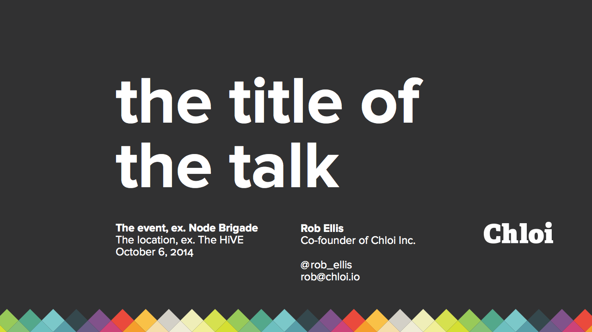
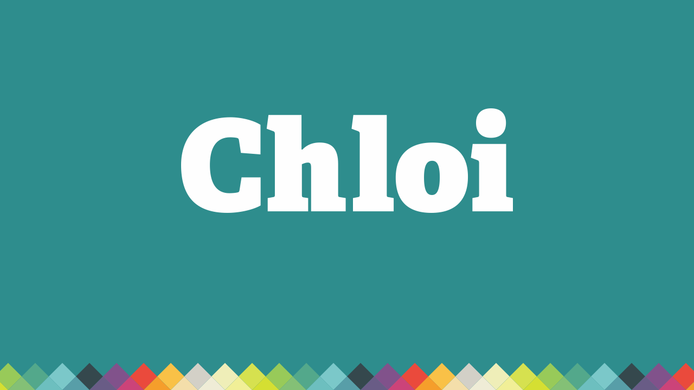
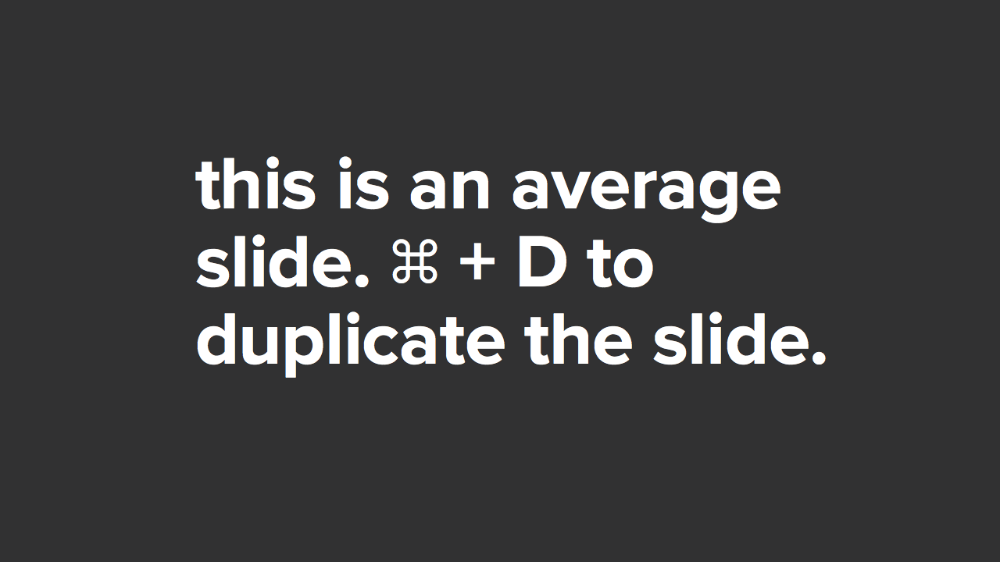
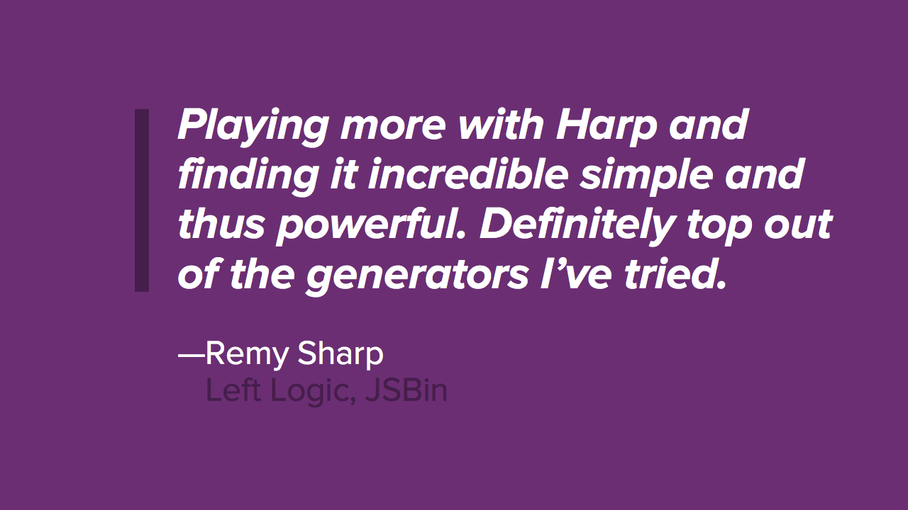

# Slides

[Chloi Inc.](http://chloi.io)-themed slide decks for various presentation tools.

## Keynote

To use the Keynote template, you’ll need to have Proxima Nova Regular, Bold, and Bold Italic installed. Either copy them out of our Dropbox into the same directory as the presentation (for when you give the presentation) or sync them through Adobe Creative Cloud.

The Harp template will match this and be added soon which won’t require this step.

## TODO

- Harp
- Slid.es?
- Reveal?

## License

Copyright © 2014 [Chloi Inc.](http://chloi.io)
